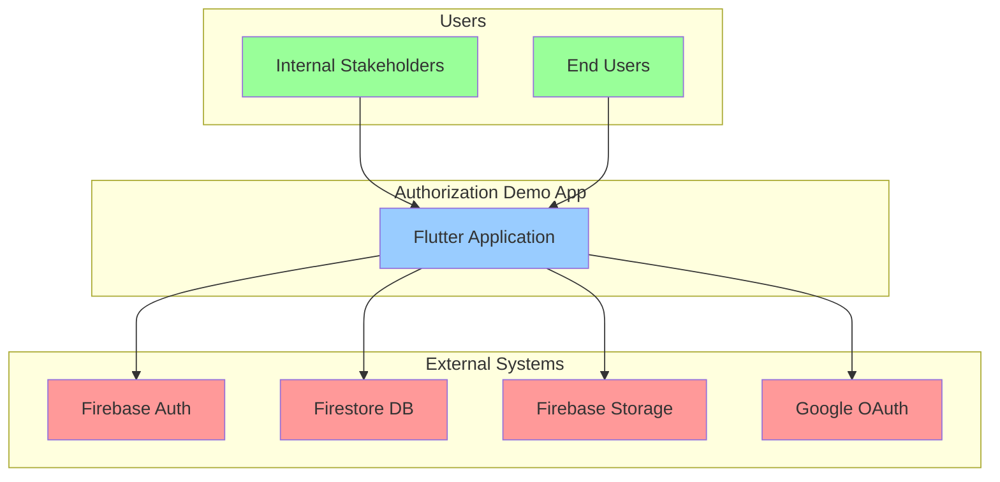
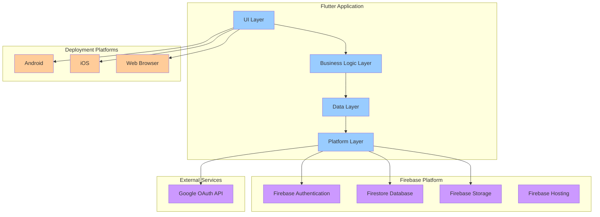
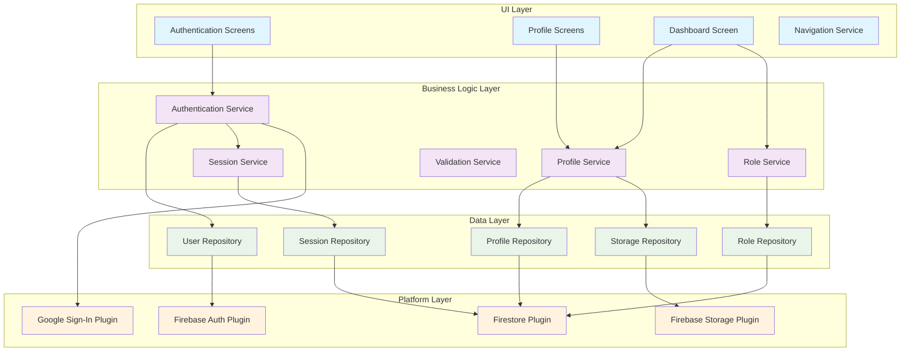
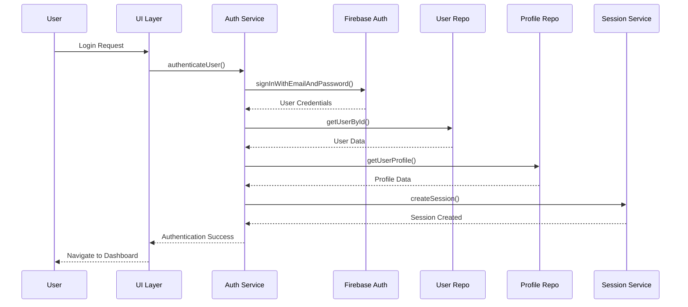
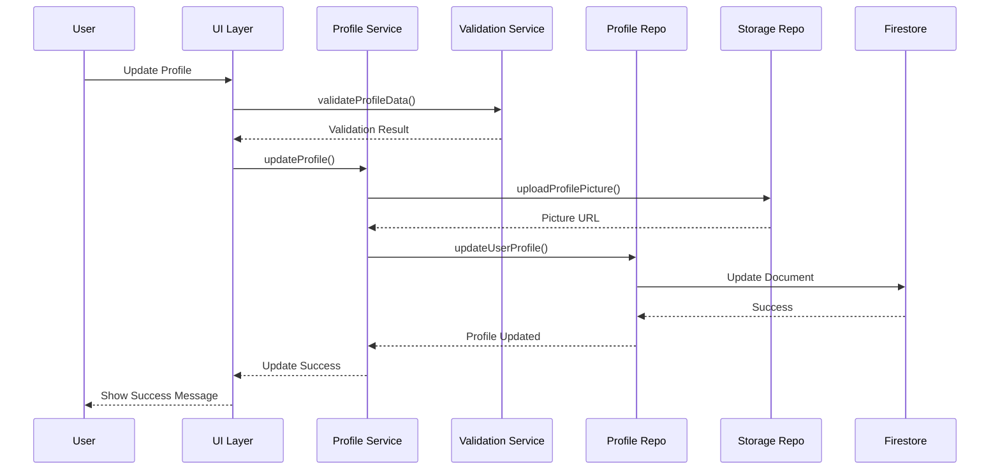
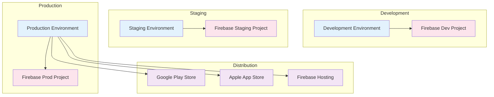

# Software Architecture: Authorization Demo Application

## Executive Summary

The Authorization Demo Application is a Flutter-based cross-platform solution designed to showcase Firebase Authentication capabilities. The architecture follows a clean, layered approach with clear separation of concerns, ensuring maintainability, testability, and scalability while meeting all PRD requirements for authentication flows, profile management, and role-based access control.

## System Context Diagram (C4 Level 1)



**Key Interactions:**

- **Stakeholders** interact with the app to evaluate Firebase Auth capabilities
- **End Users** perform authentication flows and profile management
- **Firebase Auth** handles authentication, session management, and user identity
- **Firestore** stores user profiles, roles, and session data
- **Firebase Storage** manages profile pictures and user uploads
- **Google OAuth** provides social login functionality

## Container Diagram (C4 Level 2)



**Container Responsibilities:**

- **UI Layer**: Flutter widgets, screens, and user interface components
- **Business Logic Layer**: Authentication services, profile management, role handling
- **Data Layer**: Repository pattern, data models, and Firebase integration
- **Platform Layer**: Platform-specific implementations and native integrations

## Component Diagram (C4 Level 3)



## Architecture Patterns & Principles

### Architectural Patterns

1. **Clean Architecture (Hexagonal)**

   - **UI Layer**: Flutter widgets and screens
   - **Business Logic Layer**: Use cases and services
   - **Data Layer**: Repositories and data sources
   - **Platform Layer**: External dependencies and plugins

2. **Repository Pattern**

   - Abstracts data access logic
   - Provides consistent interface for data operations
   - Enables easy testing and mocking

3. **Service Layer Pattern**

   - Encapsulates business logic
   - Provides reusable services across the application
   - Maintains separation of concerns

4. **Dependency Injection**
   - Loose coupling between components
   - Easier testing and maintenance
   - Flexible configuration management

### Design Principles

- **SOLID Principles**: Applied throughout the architecture
- **DRY**: Avoid code duplication across layers
- **Single Responsibility**: Each component has one clear purpose
- **Open/Closed**: Extensible without modification
- **Dependency Inversion**: High-level modules don't depend on low-level modules

## Technology Stack

### Frontend Framework

- **Flutter 3.x**: Cross-platform UI framework
- **Dart 3.x**: Programming language
- **Material Design 3**: UI component library

### State Management

- **Provider/Riverpod**: State management solution
- **ChangeNotifier**: For simple state management
- **Future/Stream**: For async operations

### Firebase Services

- **Firebase Authentication**: User authentication and session management
- **Cloud Firestore**: NoSQL database for user data
- **Firebase Storage**: File storage for profile pictures
- **Firebase Hosting**: Web deployment platform

### Development Tools

- **Flutter CLI**: Development and build tools
- **Dart DevTools**: Debugging and profiling
- **Firebase CLI**: Firebase project management

## Security Architecture

### Authentication Security

- **Firebase Auth**: Industry-standard authentication
- **JWT Tokens**: Secure session management
- **OAuth 2.0**: Google social login
- **Email Verification**: Account ownership verification

### Data Security

- **Firestore Security Rules**: Row-level security
- **Firebase Storage Rules**: File access control
- **HTTPS**: All communications encrypted
- **Input Validation**: Client and server-side validation

### Access Control

- **Role-Based Access Control (RBAC)**: User permissions
- **Principle of Least Privilege**: Minimal necessary access
- **Session Management**: Secure session handling
- **Audit Logging**: Security event tracking

## Data Flow Architecture

### Authentication Flow



### Profile Management Flow



## Performance & Scalability

### Performance Considerations

- **Lazy Loading**: Load data on demand
- **Caching Strategy**: Cache frequently accessed data
- **Image Optimization**: Compress and resize profile pictures
- **Offline Support**: Firestore offline persistence

### Scalability Patterns

- **Horizontal Scaling**: Firebase handles backend scaling
- **CDN**: Firebase Hosting provides global content delivery
- **Database Indexing**: Optimized Firestore queries
- **Connection Pooling**: Firebase SDK handles connections

### Performance Targets

- **App Launch**: < 3 seconds
- **Authentication**: < 2 seconds
- **Profile Loading**: < 1 second
- **Image Upload**: < 5 seconds (depending on size)

## Deployment Architecture

### Platform Deployment



### CI/CD Pipeline

```mermaid
graph LR
    subgraph "Source Control"
        GIT[Git Repository]
    end

    subgraph "Build & Test"
        BUILD[Flutter Build]
        TEST[Unit Tests]
        INTEGRATION[Integration Tests]
    end

    subgraph "Quality Gates"
        LINT[Code Linting]
        SECURITY[Security Scan]
        COVERAGE[Test Coverage]
    end

    subgraph "Deployment"
        DEV_DEPLOY[Deploy to Dev]
        STAGING_DEPLOY[Deploy to Staging]
        PROD_DEPLOY[Deploy to Production]
    end

    GIT --> BUILD
    BUILD --> TEST
    TEST --> INTEGRATION
    INTEGRATION --> LINT
    LINT --> SECURITY
    SECURITY --> COVERAGE
    COVERAGE --> DEV_DEPLOY
    DEV_DEPLOY --> STAGING_DEPLOY
    STAGING_DEPLOY --> PROD_DEPLOY
```



## Monitoring & Observability

### Logging Strategy

- **Application Logs**: Flutter logging framework
- **Firebase Analytics**: User behavior tracking
- **Crashlytics**: Error reporting and crash analysis
- **Performance Monitoring**: Firebase Performance Monitoring

### Metrics & KPIs

- **Authentication Success Rate**: > 95%
- **Profile Completion Rate**: > 80%
- **App Crash Rate**: < 1%
- **User Session Duration**: Track engagement
- **Feature Usage**: Monitor demo effectiveness

### Alerting

- **Authentication Failures**: High failure rate alerts
- **Database Errors**: Firestore operation failures
- **Storage Issues**: Firebase Storage problems
- **Performance Degradation**: Response time alerts

## Development Guidelines

### Code Organization

```
lib/
├── main.dart
├── app/
│   ├── app.dart
│   └── routes.dart
├── core/
│   ├── constants/
│   ├── errors/
│   ├── utils/
│   └── validators/
├── data/
│   ├── models/
│   ├── repositories/
│   └── datasources/
├── domain/
│   ├── entities/
│   ├── repositories/
│   └── usecases/
├── presentation/
│   ├── screens/
│   ├── widgets/
│   └── providers/
└── platform/
    ├── firebase/
    └── plugins/
```

### Coding Standards

- **Dart Style Guide**: Follow official Dart conventions
- **Flutter Best Practices**: Use recommended Flutter patterns
- **Error Handling**: Comprehensive error handling and user feedback
- **Documentation**: Inline documentation for complex logic
- **Testing**: Unit tests for business logic, widget tests for UI

### Testing Strategy

- **Unit Tests**: Business logic and services
- **Widget Tests**: UI components and screens
- **Integration Tests**: End-to-end user flows
- **Firebase Emulator**: Local testing environment

## Risk Assessment & Mitigation

### Technical Risks

1. **Firebase Service Outages**
   - **Mitigation**: Implement offline capabilities and graceful degradation
2. **Cross-Platform Compatibility**
   - **Mitigation**: Extensive testing on all target platforms
3. **Authentication Security**
   - **Mitigation**: Follow Firebase security best practices and regular audits

### Business Risks

1. **Demo Effectiveness**
   - **Mitigation**: Regular stakeholder feedback and iteration
2. **Performance Issues**
   - **Mitigation**: Performance monitoring and optimization

## Future Considerations

### Scalability Enhancements

- **Microservices**: Break down into smaller services if needed
- **Caching Layer**: Implement Redis for frequently accessed data
- **CDN**: Global content delivery for better performance

### Feature Extensions

- **Multi-language Support**: Internationalization
- **Advanced Analytics**: Detailed user behavior tracking
- **Admin Dashboard**: User management interface
- **API Gateway**: RESTful API for external integrations

### Technology Evolution

- **Flutter Updates**: Stay current with Flutter releases
- **Firebase Features**: Leverage new Firebase capabilities
- **Security Updates**: Regular security patches and updates

## Conclusion

This architecture provides a solid foundation for the authorization demo application, ensuring it meets all PRD requirements while maintaining high quality, security, and performance standards. The clean architecture approach enables easy maintenance, testing, and future enhancements, making it suitable for stakeholder demonstrations and potential production use.

The architecture balances simplicity with robustness, using proven technologies and patterns that ensure reliability while keeping the implementation straightforward for development teams.
