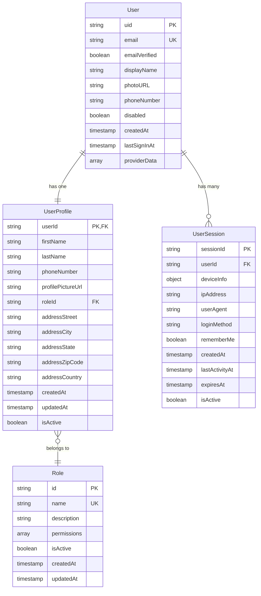

# Data Layer Analysis: Authorization Demo Application

## Executive Summary

Based on the PRD analysis, the authorization demo application requires a comprehensive data model to support Firebase Authentication integration, user profile management, role-based access control, and cross-platform functionality. The data layer consists of 4 core entities with well-defined relationships and validation rules.

## Data Entity Analysis

### 1. User Entity

**Purpose:** Core user account information managed by Firebase Authentication

**Primary Key:** `uid` (Firebase Auth User ID)

**Attributes:**

- `uid` (String, Primary Key) - Firebase Auth unique identifier
- `email` (String, Required) - User's email address (unique)
- `emailVerified` (Boolean, Required) - Email verification status
- `displayName` (String, Optional) - User's display name from Firebase
- `photoURL` (String, Optional) - Profile picture URL from Firebase
- `phoneNumber` (String, Optional) - User's phone number
- `disabled` (Boolean, Required) - Account status (disabled/enabled)
- `createdAt` (Timestamp, Required) - Account creation timestamp
- `lastSignInAt` (Timestamp, Optional) - Last sign-in timestamp
- `providerData` (Array, Required) - Authentication provider information

**Business Rules:**

- Email must be unique across all users
- Email verification status must be tracked
- Account can be disabled without deletion
- Provider data tracks authentication method (email/password, Google)

**Firebase Integration:**

- Maps directly to Firebase Auth User object
- Syncs with Firebase Auth state changes
- Handles multiple authentication providers

### 2. UserProfile Entity

**Purpose:** Extended user profile information beyond Firebase Auth

**Primary Key:** `userId` (Foreign Key to User.uid)

**Attributes:**

- `userId` (String, Primary Key) - References User.uid
- `firstName` (String, Required) - User's first name
- `lastName` (String, Required) - User's last name
- `phoneNumber` (String, Optional) - User's phone number (can override Firebase)
- `profilePictureUrl` (String, Optional) - Custom profile picture URL
- `roleId` (String, Required) - References Role.id
- `createdAt` (Timestamp, Required) - Profile creation timestamp
- `updatedAt` (Timestamp, Required) - Last profile update timestamp
- `isActive` (Boolean, Required) - Profile active status

**Address Components:**

- `addressStreet` (String, Required) - Street address
- `addressCity` (String, Required) - City
- `addressState` (String, Required) - State/Province
- `addressZipCode` (String, Required) - ZIP/Postal code
- `addressCountry` (String, Required) - Country (default: application default)

**Business Rules:**

- One profile per user (1:1 relationship with User)
- Profile picture can be different from Firebase photoURL
- Address components are required for complete profile
- Role assignment is mandatory

**Validation Rules:**

- First name and last name: 1-50 characters, alphanumeric + spaces
- Phone number: International format validation
- Address fields: Non-empty strings
- ZIP code: Format validation based on country

### 3. Role Entity

**Purpose:** Role-based access control definitions

**Primary Key:** `id` (String)

**Attributes:**

- `id` (String, Primary Key) - Unique role identifier
- `name` (String, Required) - Human-readable role name
- `description` (String, Optional) - Role description
- `permissions` (Array<String>, Required) - List of permission codes
- `isActive` (Boolean, Required) - Role active status
- `createdAt` (Timestamp, Required) - Role creation timestamp
- `updatedAt` (Timestamp, Required) - Last role update timestamp

**Default Roles:**

- `admin` - Full system access
- `user` - Standard user access
- `guest` - Limited read-only access

**Business Rules:**

- Role names must be unique
- At least one permission required per role
- Roles cannot be deleted if assigned to users
- Permission codes follow hierarchical naming (e.g., "auth.login", "profile.edit")

### 4. UserSession Entity

**Purpose:** Track user sessions and authentication state

**Primary Key:** `sessionId` (String)

**Attributes:**

- `sessionId` (String, Primary Key) - Unique session identifier
- `userId` (String, Required) - References User.uid
- `deviceInfo` (Object, Required) - Device/platform information
- `ipAddress` (String, Optional) - User's IP address
- `userAgent` (String, Optional) - Browser/client information
- `loginMethod` (String, Required) - Authentication method used
- `rememberMe` (Boolean, Required) - Remember me option selected
- `createdAt` (Timestamp, Required) - Session creation timestamp
- `lastActivityAt` (Timestamp, Required) - Last activity timestamp
- `expiresAt` (Timestamp, Required) - Session expiration timestamp
- `isActive` (Boolean, Required) - Session active status

**Device Info Object:**

- `platform` (String) - "android", "ios", "web"
- `deviceModel` (String) - Device model information
- `appVersion` (String) - Application version
- `osVersion` (String) - Operating system version

**Business Rules:**

- Sessions expire based on remember me setting
- Multiple active sessions allowed per user
- Session tracking for security and analytics
- Automatic cleanup of expired sessions

## Data Relationships

### Entity Relationship Diagram



### Relationship Details

1. **User ↔ UserProfile (1:1)**

   - One user has exactly one profile
   - Profile cannot exist without user
   - Cascade delete: User deletion removes profile

2. **User ↔ UserSession (1:Many)**

   - One user can have multiple active sessions
   - Sessions track authentication across devices
   - Sessions automatically expire

3. **UserProfile ↔ Role (Many:1)**
   - Multiple users can have the same role
   - Each user must have exactly one role
   - Role changes require profile update

## Data Flow Analysis

### Authentication Flow Data Movement

1. **User Registration**

   - Firebase Auth creates User entity
   - Application creates UserProfile entity
   - Default role assigned (typically "user")
   - Initial UserSession created

2. **User Login**

   - Firebase Auth validates credentials
   - User entity updated (lastSignInAt)
   - New UserSession created
   - UserProfile and Role data retrieved

3. **Profile Updates**

   - UserProfile entity updated
   - Address components validated
   - Profile picture uploaded to Firebase Storage
   - updatedAt timestamp refreshed

4. **Session Management**
   - UserSession entities tracked across devices
   - Expired sessions automatically cleaned up
   - Remember me affects session duration

## Data Storage Strategy

### Firebase Services Mapping

1. **Firebase Authentication**

   - User entity (managed by Firebase)
   - Authentication state and tokens
   - Provider data (Google, email/password)

2. **Firestore Database**

   - UserProfile entity
   - Role entity
   - UserSession entity
   - User preferences and settings

3. **Firebase Storage**
   - Profile pictures
   - User-uploaded content
   - Temporary files

### Data Access Patterns

1. **Read Operations**

   - User profile data (frequent)
   - Role permissions (cached)
   - Session validation (frequent)

2. **Write Operations**
   - Profile updates (moderate)
   - Session creation/updates (frequent)
   - Role assignments (infrequent)

## Data Validation Rules

### Input Validation

1. **Email Validation**

   - Format: RFC 5322 compliant
   - Uniqueness: Check against existing users
   - Domain validation: Basic MX record check

2. **Phone Number Validation**

   - Format: International format (+1-555-123-4567)
   - Country code validation
   - Length validation (7-15 digits)

3. **Address Validation**

   - Street: Non-empty, max 100 characters
   - City: Non-empty, max 50 characters
   - State: Non-empty, max 30 characters
   - ZIP: Format validation per country
   - Country: Valid country code

4. **Name Validation**
   - First/Last name: 1-50 characters
   - Alphanumeric + spaces only
   - No special characters except hyphens and apostrophes

### Business Rule Validation

1. **Role Assignment**

   - User must have exactly one role
   - Role must be active
   - Admin role requires special permissions

2. **Session Management**

   - Session duration based on remember me setting
   - Maximum concurrent sessions per user
   - Automatic session cleanup

3. **Profile Completeness**
   - Required fields must be filled
   - Address components must be complete
   - Profile picture optional but recommended

## Security Considerations

### Data Classification

1. **Public Data**

   - User display name
   - Profile picture (if public)
   - Role name (not permissions)

2. **Internal Data**

   - User profile details
   - Session information
   - Authentication logs

3. **Confidential Data**

   - Email addresses
   - Phone numbers
   - Address information

4. **Restricted Data**
   - Authentication tokens
   - Session IDs
   - Role permissions

### Security Requirements

1. **Data Encryption**

   - All data encrypted at rest
   - HTTPS for all data transmission
   - Sensitive fields encrypted separately

2. **Access Control**

   - Role-based permissions
   - User can only access own data
   - Admin access for user management

3. **Audit Logging**
   - All profile changes logged
   - Authentication events tracked
   - Session creation/termination logged

## Performance Considerations

### Indexing Strategy

1. **Primary Indexes**

   - User.uid (Firebase Auth)
   - UserProfile.userId
   - UserSession.sessionId
   - Role.id

2. **Secondary Indexes**

   - User.email (for email lookups)
   - UserProfile.roleId (for role-based queries)
   - UserSession.userId (for user sessions)
   - UserSession.expiresAt (for cleanup)

3. **Composite Indexes**
   - UserSession (userId, isActive)
   - UserProfile (userId, isActive)

### Caching Strategy

1. **Application Cache**

   - Role permissions (frequently accessed)
   - User profile data (session-scoped)
   - Authentication state (session-scoped)

2. **Firebase Cache**
   - Firestore offline persistence
   - Authentication state persistence
   - Storage file caching

## Implementation Specifications

### Firestore Collection Structure

```javascript
// Users (Firebase Auth managed)
users/{uid}
  - email: string
  - emailVerified: boolean
  - displayName: string
  - photoURL: string
  - phoneNumber: string
  - disabled: boolean
  - createdAt: timestamp
  - lastSignInAt: timestamp
  - providerData: array

// User Profiles
userProfiles/{userId}
  - firstName: string
  - lastName: string
  - phoneNumber: string
  - profilePictureUrl: string
  - roleId: string
  - addressStreet: string
  - addressCity: string
  - addressState: string
  - addressZipCode: string
  - addressCountry: string
  - createdAt: timestamp
  - updatedAt: timestamp
  - isActive: boolean

// Roles
roles/{roleId}
  - name: string
  - description: string
  - permissions: array
  - isActive: boolean
  - createdAt: timestamp
  - updatedAt: timestamp

// User Sessions
userSessions/{sessionId}
  - userId: string
  - deviceInfo: object
  - ipAddress: string
  - userAgent: string
  - loginMethod: string
  - rememberMe: boolean
  - createdAt: timestamp
  - lastActivityAt: timestamp
  - expiresAt: timestamp
  - isActive: boolean
```

### Data Access Layer

1. **Repository Pattern**

   - UserRepository (Firebase Auth integration)
   - UserProfileRepository (Firestore operations)
   - RoleRepository (role management)
   - SessionRepository (session tracking)

2. **Service Layer**

   - AuthenticationService (Firebase Auth wrapper)
   - ProfileService (profile management)
   - RoleService (permission checking)
   - SessionService (session management)

3. **Validation Layer**
   - Input validators for all forms
   - Business rule validators
   - Data integrity checkers

## Data Migration and Setup

### Initial Data Setup

1. **Default Roles**

   - Create admin, user, and guest roles
   - Define permissions for each role
   - Set up role hierarchy

2. **System Configuration**

   - Default country settings
   - Session timeout configurations
   - Email verification settings

3. **Index Creation**
   - Create all required Firestore indexes
   - Set up security rules
   - Configure backup strategies

### Data Migration Strategy

1. **User Data Migration**

   - Migrate existing user accounts
   - Create user profiles for existing users
   - Assign default roles

2. **Profile Data Migration**
   - Migrate existing profile data
   - Validate and clean data
   - Update timestamps

## Quality Assurance

### Data Quality Metrics

1. **Completeness**

   - Profile completion rate
   - Required field fill rates
   - Address completeness

2. **Accuracy**

   - Email validation success rate
   - Phone number format accuracy
   - Address validation success

3. **Consistency**
   - Role assignment consistency
   - Session state consistency
   - Profile data consistency

### Monitoring and Alerts

1. **Data Quality Monitoring**

   - Profile completion tracking
   - Validation error rates
   - Data integrity checks

2. **Performance Monitoring**

   - Query performance metrics
   - Cache hit rates
   - Storage usage tracking

3. **Security Monitoring**
   - Authentication failure rates
   - Suspicious session activity
   - Unauthorized access attempts

## Conclusion

This data layer analysis provides a comprehensive foundation for implementing the authorization demo application. The four core entities (User, UserProfile, Role, UserSession) support all PRD requirements while maintaining data integrity, security, and performance. The Firebase integration strategy ensures seamless authentication while providing the flexibility needed for custom profile management and role-based access control.

The implementation should follow the phased approach outlined in the PRD, starting with core authentication entities and progressively adding profile management and advanced features. Regular data quality monitoring and performance optimization will ensure the demo application meets stakeholder expectations.
